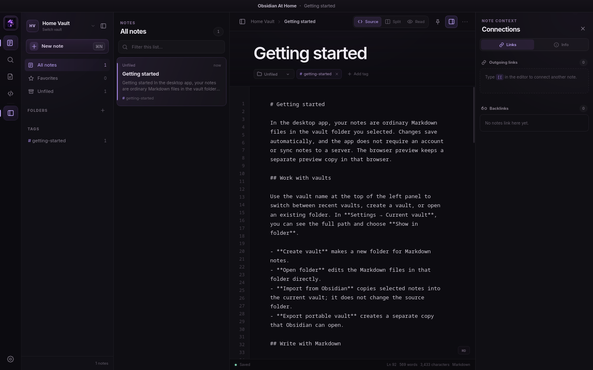

<p align="center">
  
</p>

<h1 align="center">Obsidian At Home</h1>

<p align="center">
  A local-only desktop app for writing, organizing, and linking Markdown notes.
</p>

<p align="center">
  <strong>Vue 3</strong> · <strong>Tauri 2</strong> · <strong>Rust</strong>
</p>



Notes stay as Markdown files in folders you choose. No account is required, and notes are not sent to a server.

This is not a complete Obsidian replacement: cloud sync, attachments, graph view, automation, and community plugins are not supported.

> [!NOTE]
> This project is not affiliated with or endorsed by Obsidian or Dynalist Inc.

## Features

- Create, open, and switch between vaults of ordinary `.md` and `.markdown` files.
- Organize notes in nested folders with drag-and-drop and right-click file actions.
- Use source, split, or reading view with interactive task checkboxes, spellcheck, syntax-highlighted code blocks, and app zoom (`Ctrl/Cmd` + `+`, `-`, or `0`).
- Link notes with `[[wiki links]]` and browse outgoing links and backlinks.
- Search titles, content, folders, and tags, or jump to a note with the quick switcher.
- Use freeform tags with suggestions from existing tags, plus favorites and templates.
- Modify the UI with [CSS snippets](docs/css-snippets.md).
- Import from Obsidian or export a portable vault.

## Storage and Obsidian compatibility

Each vault is a folder on your computer. Notes are ordinary Markdown files you can edit with other tools. Only app metadata is stored in `.obsidian-at-home/state.json`.

Open an existing Markdown or Obsidian vault directly, or use Settings to:

- **Import from Obsidian** copies notes, folders, and CSS snippets into the current vault. Notes can be merged or replaced; the source is unchanged.
- **Export portable vault** creates an Obsidian-compatible copy of notes, templates, and CSS snippets without overwriting existing folders.

Neither option copies attachments, Canvas files, themes, plugins, hotkeys, or workspace settings. They are not backup or sync tools.

## Build and install

### Prerequisites

- [Node.js](https://nodejs.org/) 22.12 or newer and npm; if using Node.js 20, use version 20.19 or newer
- A stable [Rust toolchain](https://rustup.rs/)
- The [Tauri prerequisites](https://v2.tauri.app/start/prerequisites/) for your operating system

Clone the repository and install dependencies:

```sh
git clone https://github.com/autoboxer/obsidian-at-home.git
cd obsidian-at-home
npm ci
```

### macOS

macOS 11 or newer is required. If needed, install Xcode Command Line Tools:

```sh
xcode-select --install
```

Build the app and DMG:

```sh
npm run desktop:build
```

Artifacts are written to `src-tauri/target/release/bundle/`. Open the DMG, then copy **Obsidian At Home** to `/Applications` (or `~/Applications` without administrator access).

The app is unsigned and not notarized. If Gatekeeper blocks your build, Control-click it, choose **Open**, and confirm.

### Linux (RHEL/Fedora)

On Fedora, install the Tauri dependencies and compiler tools:

```sh
sudo dnf install webkit2gtk4.1-devel openssl-devel curl wget file libappindicator-gtk3-devel librsvg2-devel libxdo-devel
sudo dnf group install "c-development"
```

On RHEL, replace the compiler group command with `sudo dnf group install "Development Tools"`. If a package is unavailable, see the [Tauri prerequisites](https://v2.tauri.app/start/prerequisites/).

Build the RPM:

```sh
npm run tauri -- build --bundles rpm
```

Install the package:

```sh
sudo dnf install ./src-tauri/target/release/bundle/rpm/*.rpm
```

## Development

| Command | Purpose |
| --- | --- |
| `npm run desktop` | Run the desktop app in development mode |
| `npm run dev` | Preview the interface at `http://localhost:1420` |
| `npm run build` | Type-check and build the frontend |
| `npm run desktop:build` | Build desktop artifacts for the current platform |
| `npm run check` | Build the frontend and run `cargo check` |

The browser preview cannot open arbitrary folders or use native import/export. It uses a separate `localStorage` vault that is not shared with the desktop app.

## License

Released under the [MIT License](LICENSE).
